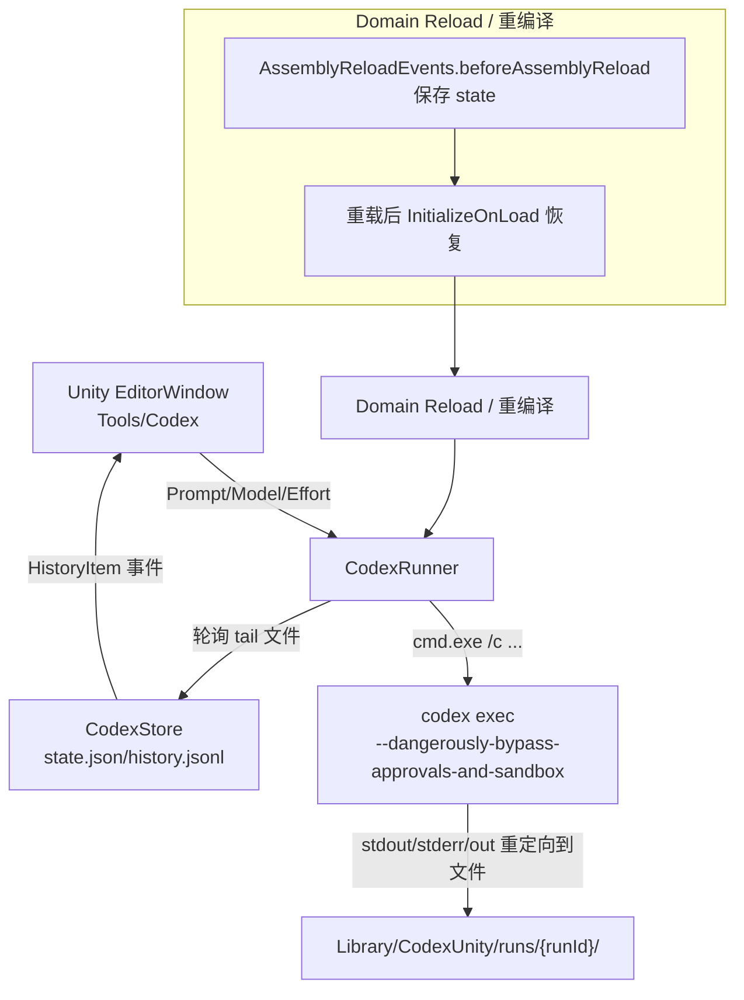

# CodexUnity (Unity Editor 插件) · v0.1

在 Unity 编辑器里直接运行 Codex CLI 的“中转站 / 控制台”，尽量做到**不离开 Unity**也能持续推进开发。

> 初衷：解决 Unity MCP 在“Unity 必须保持焦点”场景下的卡顿问题——如果频繁切到外部 IDE/CLI 操作，Unity 丢失焦点会导致 MCP 通信推进不顺畅。CodexUnity 把 Codex 的交互搬进 Unity 内部，尽量在 Unity 内完成协调与迭代。

## 这是什么

- Unity EditorWindow：`Tools/Codex`
- 在 Unity 内部启动并管理 `codex` 子进程，展示输出、保存历史、管理运行目录
- **重点解决**：Unity 重编译/Domain Reload 后，传统管线（stdout/stderr 读取线程）断连的问题

## 关键特性（0.1）

- Domain Reload 安全：采用**文件重定向 + 轮询读取**，重编译后可恢复并继续追踪输出
- 运行记录持久化：状态与历史存放在 `Library/CodexUnity/`
- 常用操作：New Task / Send / Kill 进程树 / 打开 run 目录 / 复制命令
- 环境检查：显示 `Git` 与 `codex` 可用状态（当前要求项目根目录已 `git init`）

## 工作原理（Mermaid）

### 为什么不用管道读 stdout/stderr？

Unity 的 Domain Reload 会终止托管线程；如果用 `RedirectStandardOutput/Error` + 后台线程读管道，重编译后线程没了，但子进程可能还在跑，导致“进程孤儿化、通信断连”。  
CodexUnity 的 v0.1 选择：**让子进程把输出写到文件**，Unity 侧只做文件轮询读取，重载后仍可继续读取同一批文件。

## 安装

当前形态为 Unity 工程内的编辑器插件目录：

- 复制 `Assets/Editor/CodexUnity/` 到你的 Unity 项目同路径下
- 打开 Unity：`Tools/Codex`

## 前置条件

- Windows（当前使用 `cmd.exe` 与 `taskkill`）
- Unity 6（理论上较新版本 Unity Editor + UI Toolkit 即可）
- 已安装 `codex` CLI，并确保命令行可用：`codex --version`
- 项目根目录为 Git 仓库（需要存在 `.git`）：`git init`

## 使用

1. Unity 顶部菜单：`Tools/Codex`
2. 在窗口中填写 Prompt / Model / Reasoning effort（以及 Debug）
3. `Send` 执行；输出与历史会写入 `Library/CodexUnity/`
4. 如果 Unity 触发重编译：窗口会在重载后自动尝试恢复运行状态并继续追踪输出

## 常见问题

- `Codex: Not found`：先在系统命令行确认 `codex --version` 可用，并确保 `codex` 在 PATH 中
- `Git: Not initialized`：在项目根目录执行 `git init`（当前版本强制要求）
- 输出/历史异常：查看 `Library/CodexUnity/runs/<runId>/` 下的 `stdout.log` / `stderr.log` / `out.txt`

## 已知限制（0.1）

- 仅 Windows（依赖 `cmd.exe` / `taskkill`）
- 目前按“单活跃运行”管理（后续规划支持多开）

## 数据落盘位置

- `Library/CodexUnity/state.json`：运行状态（runId、pid、是否 running 等）
- `Library/CodexUnity/history.jsonl`：对话/事件历史（用于 UI 回放）
- `Library/CodexUnity/runs/<runId>/`：本次运行的 `out.txt` / `stdout.log` / `stderr.log` / `events.jsonl` / `meta.json`

## 安全警告（务必阅读）

本插件为了与 Unity 进行“强交互”而默认以 **Codex 全权限**运行：`--dangerously-bypass-approvals-and-sandbox`。这意味着 Codex 侧可能执行任意文件写入/命令调用，风险极高。

- 强烈建议：**在使用前确保项目已做 Git 保护**（`git init`、频繁提交、必要时启用分支/保护规则）
- 不建议在包含敏感凭据、私密资料或生产环境代码的目录直接使用
- 任何自动化修改都应通过 Git diff/审查确认后再合并

更多建议见 `SECURITY.md`。

## 升级规划（方向）

- 提升可用性（更清晰的状态/错误提示、运行恢复策略、UX 打磨）
- 支持子进程多开（并发 runs 管理、队列/多会话）
- 路径与抽象完善后，考虑接入更多不同模型/不同 CLI 形态

## 版本

- v0.1：勉强可用的实验版本（接口/行为可能随时变化）
